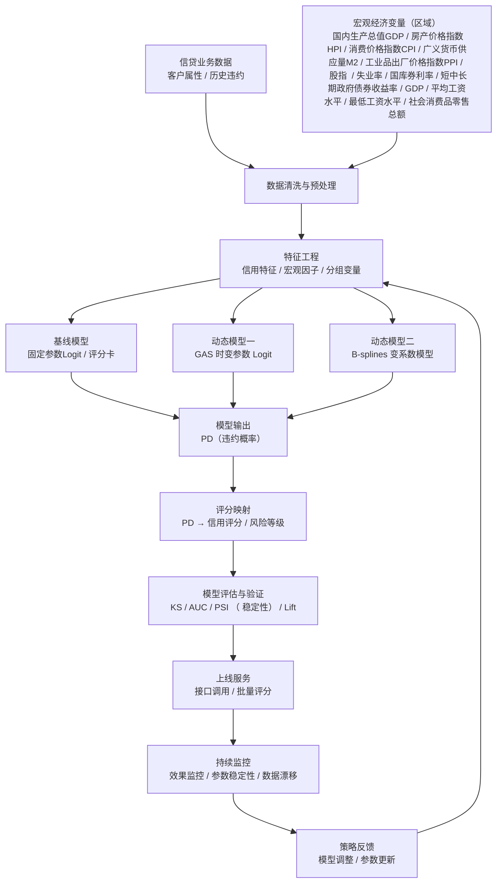

[toc]

# 信用风险动态模型实施方案




------

## 一、项目背景与建设目标

### 1.1 项目背景

随着宏观经济环境和监管政策的持续变化，个人信贷与消费金融业务面临的信用风险呈现出**显著的时变特征**。利率调整、经济周期波动、就业环境变化等因素均可能导致借款人违约概率发生系统性变化。

当前信用风险管理主要依赖**固定参数的评分模型或逻辑回归模型**，其核心假设是风险因子与违约概率之间的关系在较长时间内保持稳定。然而在实际业务中，该假设在经济下行或结构性调整阶段往往难以成立，进而可能影响模型的预测能力与风险识别效果。

------

### 1.2 建设目标

本项目拟构建一套**信用风险动态建模与评估方案**，实现以下目标：

1. 刻画信用风险参数随时间及宏观环境变化的动态特征；
2. 提升模型在不同经济阶段（尤其是下行期）的风险区分能力与稳定性；
3. 在保证解释性的前提下，实现模型的工程化落地与持续监控；
4. 为风险策略调整与前瞻性管理提供量化依据。

------

## 二、需求分析与业务痛点

### 2.1 现有模型与流程现状

- 当前主要模型类型：
  - 固定参数逻辑回归 / 评分卡模型；
- 模型更新方式：
  - 按季度或年度重新训练；
- 宏观变量使用方式：
  - 作为静态特征一次性进入模型；
- 模型评估指标：
  - KS、AUC、PSI 等。

------

### 2.2 核心业务痛点分析

#### （1）时间适应性不足

- 宏观经济环境变化速度快；
- 模型参数更新滞后；
- 固定参数假设在经济周期切换阶段容易失效。

> 痛点总结：
> 固定参数模型难以动态反映信用风险对宏观环境变化的敏感性。

------

#### （2）风险解释能力有限

- 现有模型可给出风险评分，但难以回答：
  - 不同阶段风险敏感度是否发生变化；
  - 宏观变量在不同时期的影响强弱差异。

------

#### （3）工程与运营成本较高

- 模型重训周期长；
- 人工干预频繁；
- 难以实现准实时的风险监控。

------

#### （4）下行周期表现不稳健

- 在经济下行或压力阶段：
  - KS、AUC 明显下降；
  - 风险暴露识别滞后。

------

## 三、总体技术路线设计

### 3.1 技术总体框架

整体技术路线如下：

```
信贷数据
    ↓
宏观变量与特征工程
    ↓
动态信用风险建模
    ↓
风险评分与违约概率输出
    ↓
模型评估与持续监控
```

------

### 3.2 技术设计原则

- **动态性**：参数可随时间或宏观环境变化；
- **解释性**：参数变化具备经济含义；
- **可落地性**：支持工程部署与自动化更新；
- **可评估性**：模型效果可量化、可对比。

------

## 四、模型与算法设计方案

### 4.1 基线模型（对照组）

- 固定参数逻辑回归 / 评分卡模型；
- 作为动态模型的效果对照基准；
- 用于评估增量收益。

------

### 4.2 动态信用风险模型设计

1. **静态 Logit 模型**
   $
   P(Y_t=1)=\frac{1}{1+\exp(-X_t\beta)}
   $
2. **时间变系数 Logit 模型**
   $
   P(Y_t=1)=\frac{1}{1+\exp(-X_t\beta_t)}
   $

#### 方案一：Score-Driven（GAS）时变参数模型
$$
f_t=\underbrace{\omega}_{长期均衡水平，\bar{f} = \frac{\omega + \sum \beta_i \bar{x}_i}{1-\sum \varphi_k}}+\sum_{i=1}^M \beta_i x_{t i}+\underbrace{\sum_{j=1}^P \alpha_j S\left(f_{t-j}\right) \nabla\left(y_{t-j}, f_{t-j}\right)}_{\text{数据修正，score}}+\underbrace{\sum_{k=1}^Q \varphi_k f_{t-k}}_{\text{惯性，AR}}
$$

- 论文：《Generalized Autoregressive Score Models with Time-Varying Parameters》 ***Journal of Time Series Analysis*, 2024**

- 采用论文作者建议：用长期均值作为初始值·
- 模型系数采用极大似然估计（MLE）
- 参数更新机制：
  - 由对数似然函数的 score 驱动；
- 特点：
  - 对最新违约信息反应灵敏；
  - 适合捕捉**短期风险波动**；
- 适用场景：
  - 市场波动期；
  - 风险快速变化阶段。

------

#### 方案二：B-splines 变系数模型

$$
\beta_t = \beta(t)\\\
\beta(t) = \sum_{k=1}^K \theta_k B_k(t,GDP_t…)\\\
传统模型：\beta = \text{常数}
$$

- 论文：《Dynamic survival models with varying coefficients for credit risks》2018

- 避免**全局依赖问题** ,**信用风险参数的变化主要来自结构性变化（周期、制度），不是高频随机冲击**;

- 参数表示方式：
  - 使用 B-spline 基函数刻画参数随时间或宏观状态的平滑变化；
- **knot结点选择**：
  - <u>多 spline + 平滑惩罚（P-splines）</u>：$\lambda \sum (\Delta^2 \phi_r)^2$​，其中
    - $\lambda$平滑参数可以用：
      - AIC / BIC

      - MCMC

      - GCV

  - <u>少 spline + 精选 knot</u>：等距/不等距，选AIC最优

- 特点：
  - 参数变化平稳、结构清晰；
  - 解释性强；
- 适用场景：
  - **中长期宏观周期分析**；
  - 风险结构演化研究。

------

### 4.3 模型选择与组合策略

- 根据经济阶段与业务需求：
  - **稳定期**：侧重 B-splines 模型；
  - **波动期**：侧重 GAS 模型；
- 或采用**模型集成方式**（**BMS/BMA**），增强稳健性。
  - 后续可以进一步：分区域实现（如东中西部 / 城市等级）；


------

## 五、系统与工程实现方案

### 5.1 系统架构设计

```
数据层 → 特征层 → 模型层 → 服务层 → 监控层
```

------

### 5.2 工程实现要点

**数据层**

- 信贷业务数据、历史违约数据：

  - 因变量：违约变量default（二元变量0-1）

  - 账户与信用历史相关变量

    - | 序号 | 变量名                              | 类型   | 说明               | 选择理由                               |
      | ---- | ----------------------------------- | ------ | ------------------ | -------------------------------------- |
      | 1    | Status of existing checking account | 类别型 | 当前支票账户状态   | 能反映申请人的流动性和财务健康水平     |
      | 3    | Credit history                      | 类别型 | 信用历史记录       | 历史信用行为对违约风险预测具有高解释力 |
      | 6    | Savings account/bonds               | 类别型 | 储蓄账户或债券情况 | 体现资产储备状况，影响还款能力         |
      | 4    | Purpose                             | 类别型 | 贷款用途           | 不同用途贷款风险特性差异明显           |

  - 信用额度与偿还能力相关变量

    - | 序号 | 变量名                                         | 类型   | 说明           | 选择理由                       |
      | ---- | ---------------------------------------------- | ------ | -------------- | ------------------------------ |
      | 2    | Duration (months)                              | 整数型 | 贷款期限（月） | 贷款期限越长，潜在违约风险越高 |
      | 5    | Credit amount                                  | 整数型 | 贷款金额       | 高额度贷款通常违约风险更高     |
      | 8    | Installment rate in % of disposable income     | 整数型 | 分期偿还比例   | 可直接衡量债务负担相对收入水平 |
      | 16   | Number of existing credits at this bank        | 整数型 | 现有银行贷款数 | 多笔贷款可能增加违约风险       |
      | 11   | Present residence since                        | 整数型 | 现居住时长     | 居住稳定性间接反映信用可靠性   |
      | 18   | Number of people liable to provide maintenance | 整数型 | 赡养人数       | 家庭负担越重，财务压力可能越大 |

  - 个人背景与社会属性变量

    - | 序号 | 变量名                     | 类型   | 说明               | 选择理由                               |
      | ---- | -------------------------- | ------ | ------------------ | -------------------------------------- |
      | 9    | Personal status and sex    | 类别型 | 婚姻状况及性别     | 社会人口属性可能影响风险偏好和还款能力 |
      | 7    | Present employment since   | 类别型 | 当前就业年限       | 就业稳定性是偿债能力的重要指标         |
      | 17   | Occupation                 | 类别型 | 职业类型           | 不同行业或职业收入稳定性差异大         |
      | 15   | Housing                    | 类别型 | 住房状况           | 自有房产 vs 租赁房影响财务安全性       |
      | 14   | Other installment plans    | 类别型 | 是否有其他分期付款 | 多重负债可能增加违约风险               |
      | 10   | Other debtors / guarantors | 类别型 | 是否有共同债务人   | 反映风险分担能力                       |

  - 二元特征

    - | 序号 | 变量名         | 类型 | 说明           | 选择理由                           |
      | ---- | -------------- | ---- | -------------- | ---------------------------------- |
      | 19   | Telephone      | 二元 | 是否有电话     | 可作为信息完整性与社会接触指标     |
      | 20   | Foreign worker | 二元 | 是否为外籍员工 | 可用于控制人口特征对信用风险的影响 |

  - 年龄变量

    - | 序号 | 变量名 | 类型   | 说明       | 选择理由                                               |
      | ---- | ------ | ------ | ---------- | ------------------------------------------------------ |
      | 13   | Age    | 整数型 | 年龄（岁） | 年龄反映借款人生命周期阶段，间接影响偿债能力与风险偏好 |

- 宏观经济指标数据（季度）：
  
  - 
  
  - | 省级宏观指标（2021第三季度—2025第三季度）       |
    | ----------------------------------------------- |
    | 地区生产总值 累计值(亿元)                       |
    | 地区生产总值指数(上年同期=100) 累计值(%)        |
    | 居民人均消费支出 累计值(元)                     |
    | 城镇居民人均消费支出 累计值(元)                 |
    | 农村居民人均消费支出 累计值(元)                 |
    | 居民人均可支配收入 累计值(元)                   |
    | 城镇居民人均可支配收入 累计值(元)               |
    | 农村居民人均可支配收入 累计值(元)               |
    | 建筑业企业签订合同金额 累计值(亿元)             |
    | 建筑业企业营业利润 累计值(亿元)                 |
    | 固定资产投资价格指数 当季值（上年同季=100）     |
    | 建筑安装工程投资价格指数 当季值（上年同季=100） |
    | 固定资产投资价格指数 当季值（上年同季=100）     |
    | 建筑安装工程投资价格指数 当季值（上年同季=100） |
  
  - 处理方式：先全国再区域，先进行回归模型，查看是否具有预测作用，再筛选
  
  - **分区域：**
  
    - **法1 门槛模型**：选取贷款人所在城市金融发展水平变量，设置门槛，门槛可以通过对比获取，超过门槛、为超过门槛各使用一套系数指标；
  
    - **法2 分城市群/区域**：
  
      - 省级数据
  
    - | 宏观变量        | 考虑地域差异原因                   |
      | :-------------- | ---------------------------------- |
      | 利率（LPR/FFR） | 一线城市房价、信贷需求对利率更敏感 |
      | 货币供给（M2）  | 金融资源向东部、核心城市集中       |
      | 失业率          | 西部/资源型城市就业弹性更大        |
      | GDP增速         | 产业结构差异 → 同样增速含义不同    |
  
    - |      等级      | 城市名单                                                     |
      | :------------: | ------------------------------------------------------------ |
      | **一线城市**4  | 北京、上海、广州、深圳                                       |
      |  **新一线**15  | 成都、杭州、重庆、苏州、武汉、西安、南京、长沙、宁波、青岛、郑州、东莞、天津、昆明、合肥 |
      | **二线城市**30 | 厦门、福州、无锡、哈尔滨、济南、佛山、长春、温州、南宁、常州、泉州、南昌、贵阳、太原、烟台、嘉兴、南通、绍兴、中山、台州、兰州、徐州、扬州、镇江、惠州、江门、珠海、汕头、揭阳 |
      |    **三线**    | 潍坊、保定、镇江、桂林、唐山、梅州、扬州、柳州、宜昌、包头、贵阳、咸阳、泉州、漳州、淄博、邯郸、临沂、德州、聊城、菏泽、洛阳、南阳、新乡、安阳、周口、驻马店、衡阳、岳阳、株洲、湘潭 |
      |  **四/五线**   | 各省下辖县级市、地级市下辖区县（如：县级市、资源型城市、人口流出型城市等） |
      |     备注：     | 城市分级参考**第一财经新一线城市研究所发布的《城市商业魅力排行榜》**，该体系综合考虑经济规模、人口吸引力、产业结构与商业资源配置情况，将城市划分为一线、新一线、二线、三线及以下等级。该分级方法已被广泛应用于宏观经济研究、金融风险评估及信贷分析中，具有较强的现实合理性和可操作性。 |
  
  - **对于中国（统计局网站获取）：**
  
    - | 宏观变量               | 理论/实证佐证              | 论文链接                                                     |
      | ---------------------- | -------------------------- | ------------------------------------------------------------ |
      | GDP 增速               | PD 模型预测显著影响        | *Using macroeconomic information...* ([thesis.eur.nl](https://thesis.eur.nl/pub/62139/Master_Thesis_Report_LMVerspeek.pdf?utm_source=chatgpt.com)) |
      | CPI（通胀）            | 信用风险实证影响           | *Stress Testing...* ([Dialnet](https://dialnet.unirioja.es/descarga/articulo/8096524.pdf?utm_source=chatgpt.com)) |
      | HPI（房价）            | 零售信贷 PD 模型显著       | *宏观压力测试下商业银行...* ([zgglkx.com](https://www.zgglkx.com/CN/10.16381/j.cnki.issn1003-207x.2020.07.002?utm_source=chatgpt.com)) |
      | Unemployment（失业率） | PD 预测重要性              | *Using macroeconomic information...* ([thesis.eur.nl](https://thesis.eur.nl/pub/62139/Master_Thesis_Report_LMVerspeek.pdf?utm_source=chatgpt.com)) |
      | 货币政策类变量         | 各类信用风险研究模型中常用 | 多文献支持（如 stress test） ([Dialnet](https://dialnet.unirioja.es/descarga/articulo/8096524.pdf?utm_source=chatgpt.com)) |
  
    - [宏观压力测试下商业银行零售信贷产品PD模型预测研究](https://www.zgglkx.com/CN/10.16381/j.cnki.issn1003-207x.2020.07.002?utm_source=chatgpt.com)
  
      - 国内生产总值GDP
      - 房产价格指数HPI
      - 消费价格指数CPI
      - 广义货币供应量M2
      - 工业品出厂价格指数PPI
      - 利率IR
      - 
  
  - 采用 **Nisso Bucay and Dan Rosen（2001）**的论文：
    - 实体经济与需求侧因子
      - 工业增加值（Industrial Production）
      - 社会消费品零售总额（Retail Sales）
  
    - 金融市场因子
      - 股票市场指数（Stock Index）
  
    - 价格水平与通胀因子
      - 消费者价格指数CPI
  
    - 劳动力市场因子
      - 失业率/失业水平（Unemployment Level）
  
    - 利率与期限结构因子
      - 三个月期国库券利率（Three-month Treasury Bill Rate）
      - 短期政府债券收益率（Short-term Government Bond Yield）
      - 中期政府债券收益率（Medium-term Government Bond Yield）
      - 长期政府债券收益率（Long-term Government Bond Yield）
  
- 自动校验与缺失处理。

**模型层**

- 动态参数更新模块；
- 滚动窗口估计机制；
- 支持多模型并行。

**服务层**

- 输出 PD、评分结果；
- 支持接口调用。

**监控层**

- 模型效果监控；

  - 有真实违约结果时：AUC / KS，Gini，准确率 / 召回率（看业务侧），违约率分桶对齐情况
  - 没有真实违约（短期）：预测 PD 的整体水平；高风险客户占比是否异常变化

- 参数稳定性监控

  - ```cpp
    每季度
    ↓
    用新数据重新估计模型
    ↓
    对比历史参数
    ↓
    超过阈值 → 稳定性预警
    ```

  - PSI

- 数据漂移监控(数据类型/结构/类别占比)

  - **PSI**：

    - $PSI = \sum (p_i - q_i)\ln\frac{p_i}{q_i}$

    - | PSI(经验阈值) | 解释     |
      | ------------- | -------- |
      | < 0.1         | 稳定     |
      | 0.1–0.25      | 轻微漂移 |
      | > 0.25        | 严重漂移 |

  - **KS**:

    - $KS = \max_x | F_{good}(x) - F_{bad}(x) |$

    - | KS 值(经验阈值) | 模型区分能力 |
      | --------------- | ------------ |
      | < 0.2           | 较弱         |
      | 0.2 – 0.4       | 可接受       |
      | > 0.4           | 较强         |


------

## 六、评测体系与评估标准

### 6.1 评测方式

| 评估维度   | 指标            |
| ---------- | --------------- |
| 区分能力   | KS、AUC         |
| 稳定性     | PSI、参数波动率 |
| 时间一致性 | 滚动窗口评估    |
| 压力期表现 | 分经济阶段对比  |


------

### 6.2 评估策略

- 对比模型：
  - 固定参数模型 vs 动态模型；
- 分阶段评估：
  - 上行期、下行期、稳定期；
  - 分区域（如城市等级、东西部）
- 重点关注：
  - 下行阶段模型稳健性；
  - 预警能力提升程度。

------

## 七、实施计划与风险控制

### 7.1 实施步骤

1. 数据梳理与需求确认（1–2 周）
2. 原型模型构建与验证（2–3 周）
3. 回测与压力测试（2 周）
4. 小范围试点运行
5. 正式上线与监控

------

### 7.2 风险与应对措施

| 潜在风险     | 应对策略         |
| ------------ | ---------------- |
| 模型过拟合   | 正则化、平滑约束 |
| 参数剧烈波动 | 稳定性约束       |
| 工程复杂度高 | 模块化设计       |

------

## 八、预期效果与价值

- 提升模型对宏观环境变化的适应能力；
- 增强下行周期风险识别效果；
- **降低模型重训与维护成本**；
- 为风险管理决策提供动态量化支持。

## 九、流程图


```Mermaid
%%{init: {'themeVariables': { 'fontSize': '12px' }}}%%
flowchart TD
    A[信贷业务数据<br/>客户属性 / 历史违约] --> B[数据清洗与预处理]
    M[宏观经济变量<br/>工业增加值/ 社会消费品零售总额 / CPI / 股指 / 失业率 / 国库券利率 / 短中长期政府债券收益率] --> B

    B --> C[特征工程<br/>信用特征 / 宏观因子 / 分组变量]

    C --> D1[基线模型<br/>固定参数Logit / 评分卡]
    C --> D2[动态模型一<br/>GAS 时变参数 Logit]
    C --> D3[动态模型二<br/>B-splines 变系数模型]

    D1 --> E[模型输出<br/>PD（违约概率）]
    D2 --> E
    D3 --> E

    E --> F[评分映射<br/>PD → 信用评分 / 风险等级]

    F --> G[模型评估与验证<br/>KS / AUC / PSI / 稳定性]

    G --> H[上线服务<br/>接口调用 / 批量评分]

    H --> I[持续监控<br/>效果监控 / 参数稳定性 / 数据漂移]

    I --> J[策略反馈<br/>模型调整 / 参数更新]
    J --> C

```
